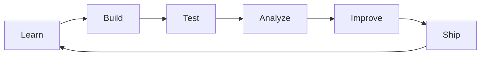

<h1 align="center">Hi 👋, I'm Akash_2006</h1>

<h3 align="center">
  Building impactful, data-driven solutions by combining AI, Big Data Analytics,
  and full-stack development while continuously learning and pushing modern tech forward.
</h3>

  

  

## About Me

- 🔭 I’m currently working on AI-driven and Big Data projects with real-world applications.
- 🌱 I’m currently learning modern tools for data engineering, analytics, and full-stack development.
- 💬 Ask me about AI, Big Data, data-driven products, and full-stack development.
- 📫 Reach me at `akashgolu2006@gmail.com`
- ⚡ I learn best by building real projects, breaking things, and improving them fast.

## Constant Workflow

My default loop is simple: learn, build, test, analyze, improve, and ship.

## Connect With Me

  
  
  
  

## Languages And Tools

  

  
  
  
  

## GitHub Analytics

  
  

  

